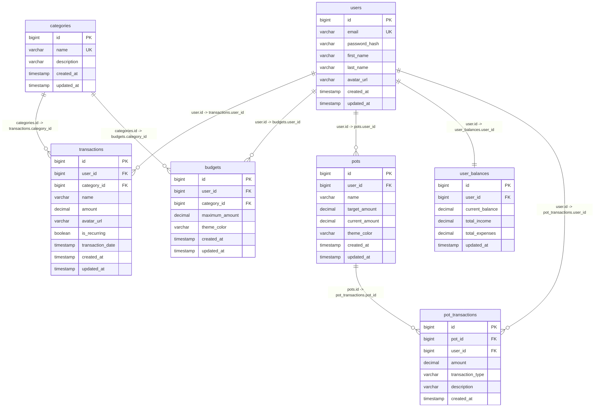

# Personal Finance App - Entity Relationship Diagram

## Table Descriptions

### users
Stores user account information including authentication details and profile data.

### categories
Defines transaction and budget categories (Bills, Dining Out, Entertainment, Personal Care, etc.).

### transactions
Records all financial transactions for users, linked to categories and users.

### budgets
Stores budget limits for each category per user with theme customization.

### pots
Manages savings goals/pots for users with target and current amounts.

### pot_transactions
Tracks deposits and withdrawals from savings pots.

### user_balances
Maintains current balance summary for each user (current, income, expenses).

## Key Relationships

- **One-to-Many**: `users.id` → `transactions.user_id`
- **One-to-Many**: `users.id` → `budgets.user_id`
- **One-to-Many**: `users.id` → `pots.user_id`
- **One-to-One**: `users.id` → `user_balances.user_id`
- **One-to-Many**: `categories.id` → `transactions.category_id`
- **One-to-Many**: `categories.id` → `budgets.category_id`
- **One-to-Many**: `pots.id` → `pot_transactions.pot_id`

## Data Types Used

- `bigint`: Primary keys and foreign keys
- `varchar`: Text fields (names, emails, descriptions)
- `decimal`: Monetary amounts with precision
- `boolean`: True/false flags
- `timestamp`: Date and time fields
- `UK`: Unique key constraint
- `PK`: Primary key
- `FK`: Foreign key